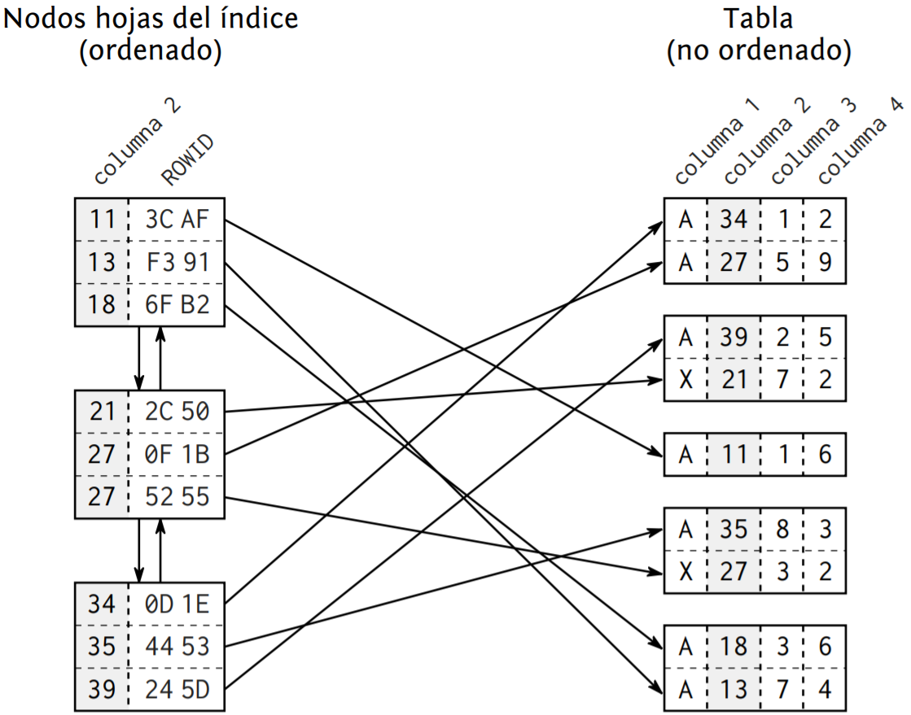
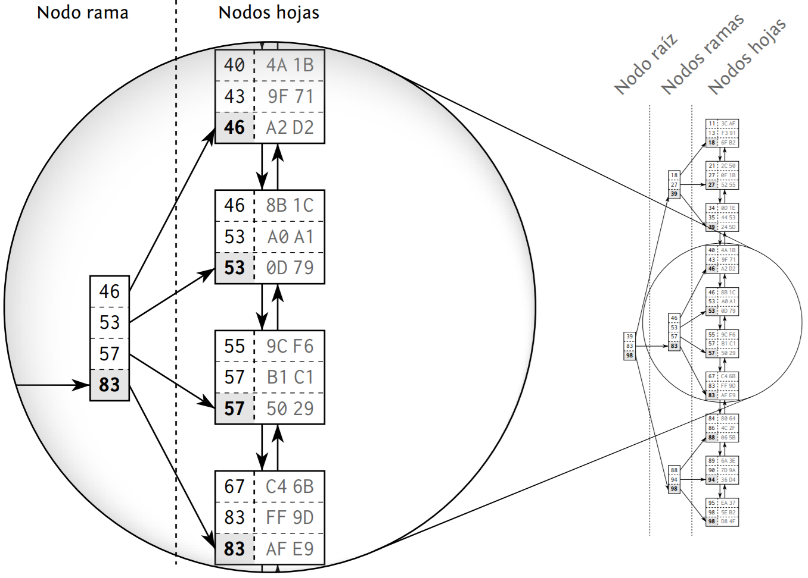
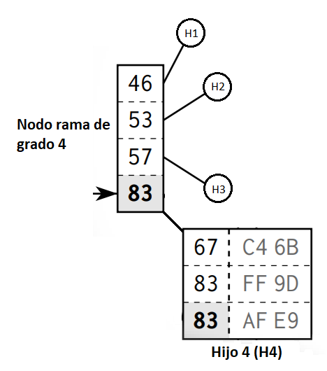
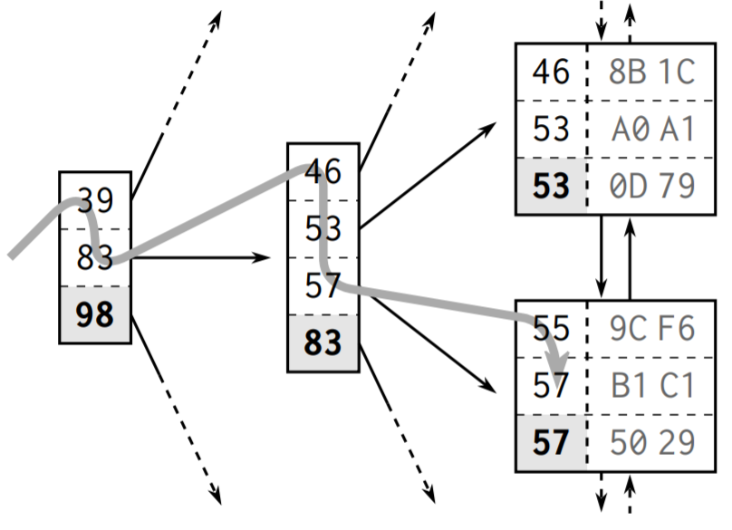

<link rel="stylesheet" type="text/css" href="estilos.css">
<div class="encabezado">
    <div class="h-izq">
        <h1 class="titulo-h1">Auronix University | <em>Curso SQL</em></h1>
    </div>
    <div class="h-der">
        <a href="#"></a>
        <a href="../"></a>
        <a href="indiceslentos.html"></a>
    </div>   
</div>

# Estructura de los índices #

{:.justificado}
La función principal de un índice en una base de datos relacional es acelerar la ejecución de las sentencias SQL, el objetivo del presente material no es tener la conceptualización superflua de cómo trabaja un índice, en realidad, lo que se quiere es profundizar hasta donde sea necesario para lograr entender los aspectos a tomar en consideración cuando se trata de optimizar las consultas SQL.

{:.justificado}
Un índice se crea a través del comando <code>create index</code>, requiere de un espacio en disco y contiene una copia parcial de los datos en la tabla. Análogamente un índice de BD se parece mucho al índice de un libro, ocupa su propio espacio, es redundante y hace referencia a la información almacenada en otro lugar.

{:.justificado}
Buscar dentro de un almacén de datos indexado, es como buscar una entrada en un directorio telefónico. La base de su funcionalidad requiere una correcta <em>estructura ordenada</em> de modo que este orden sirva para clasificar y determinar la posición de cada elemento lo más rápido y optimizado que se pueda, sin embargo, un índice en una BD es algo más complejo que un directorio telefónico debido a que constantemente está siendo modificado por operaciones de inserción, borrado o incluso actualización. Estas operaciones deben hacerse rápidamente conservando el orden y sin mover grandes cantidades de datos.

{:.justificado}
Claramente, un índice de BD es un desafío que, para nuestra fortuna, el motor de BD ya resuelve, no obstante, es imperativo que los desarrolladores conozcan tanto su estructura como su comportamiento.

{:.justificado}
La BD puede implementar dos tipos de índices, uno llamado [BTREE](btree.md) basado en las estructuras de datos [LISTA DOBLEMENTE ENLAZADA](lista-doble.md) y [ÁRBOL B](arbol-b.md), el segundo tipo de índice se implementa a través de un HASH. Los índices de tipo btree son adecuados para consultas que usan operadores de relación y de rango, tales como <code> <, >, =, <> y between</code>, mientras que los de tipo hash son funcionales cuando las consultas usan únicamente operadores de igualdad exacta <code>=</code>, cabe mencionar que el índice de tipo hash puede presentar colisiones, suele ser más lento que btree en consultas que involucran rangos y no puede emplearse la cláusula <code>orden by</code> con ellos. En el caso particular de MySQL, se usan los índices de tipo btree, y por este motivo profundizaremos más en estos.

## Nodos hoja en un BTREE

{:.justificado}
Para entender paulatinamente la estructura interna y funcionamiento de los índices btree, es recomendable iniciar su análisis por los nodos hoja. El propósito de un índice es proporcionar una representación ordenada de los datos, sin embargo, no es posible almacenar datos de forma secuencial debido que una operación de `insert` tendría que mover grandes cantidades de datos provocando consumo excesivo de tiempo y lentitud en la ejecución. Este problema se soluciona usando una estructura que mantenga un orden lógico independiente del orden físico de los datos, esta estructura de datos se llama lista doblemente enlazada donde la ubicación física de los nuevos nodos que se insertan no tiene importancia debido al orden lógico que la estructura mantiene. Como esta estructura mantiene una referencia al nodo anterior y al siguiente, la BD puede leer el índice hacia adelante o hacia atrás según sea necesario. Además, la inserción o eliminación de un nodo no requiere que se muevan grandes cantidades de datos ya que solo se requiere actualizar los apuntadores.

{:.justificado}
Específicamente, los índices BTree utilizan una lista doblemente enlazada para apuntar los nodos hoja, cada nodo hoja se almacena en un bloque dentro de la BD, a este bloque también se le conoce como página y suele tener un tamaño de algunos kilobytes. El orden del índice se mantiene en dos niveles diferentes, los registros del índice que llevan a los nodos hoja y los nodos hoja interconectados entre sí por medio de una lista doblemente enlazada.

<div class="img-centrada">
    <br/>
    <strong>Figura 1.1. La conexión entre los nodos hoja y los registros de la tabla.</strong>
</div>

{:.justificado}
La *figura 1.1* muestra la conexión que existe entre los nodos hoja (parte izquierda) y los registros de la tabla (parte derecha), nota que la tabla fue indexada por la columna 2, de modo que este campo es el que se toma en cuenta para construir los nodos hoja del índice, cada entrada en un nodo de la lista enlazada consta de al menos dos campos, la llave y un campo especial llamado rowid cuyo objetivo es referenciar la dirección física donde se encuentra almacenado el registro. A diferencia del índice, los datos de la tabla están almacenados en una estructura que no está ordenada, no existe relación entre los registros almacenados en el mismo bloque de la tabla, ni existen conexiones entre los bloques.

## Árbol de búsqueda BTREE

{:.justificado}
Para almacenar los índices, la BD hace uso de un [árbol de búsqueda equilibrado](arbol-busqueda-equilibrado.md), específicamente un BTree, esta estructura implementa nodos donde almacena información para encontrar rápidamente un nodo hoja en la lista enlazada, regularmente el tiempo para encontrar un nodo es logarítmico, se usa el mismo principio de la [búsqueda binaria](busqueda.binaria), iniciando en la raíz del árbol y descendiendo por sus ramas hasta los nodos hoja, escogiendo en el recorrido los subnodos de las ramas de acuerdo a la posición relativa del valor buscado respecto a los valores de cada nodo. Considere el siguiente ejemplo de un árbol de índices BTree.

<div class="img-centrada">
    <br/>
    <strong>Figura 1.2. Estructura de un BTree.</strong>
</div>

{:.justificado}
La *figura 1.2* muestra la estructura de índices creada con un BTree, la lista doblemente enlazada establece el orden lógico entre los nodos hoja mientras la raíz y sus ramas permiten hacer búsquedas rápidas entre los nodos hoja. Para ponerlo de una forma más clara consideremos los siguientes puntos sobre el ejemplo en la figura:

{:.justificado}
- Es un BTree que se ha construido con 30 registros.

- Es de grado cuatro, es decir, el máximo número de hijos que puede tener un nodo es cuatro, en la *figura 1.3* podemos observar el nodo `[46, 53, 57, 83]` que tomaremos como nodo ejemplo, se dice que es de grado cuatro porque tiene cuatro hijos: **H1**, **H2**, **H3** y **H4**.

<div class="img-centrada">
    <br/>
    <strong>Figura 1.3. Estructura de un nodo en el BTree</strong>
</div>

{:.justificado}
-	Las llaves que se agrupan en un nodo siempre están ordenadas de menor a mayor.

-	Cada llave almacenada en el nodo, representa a un nodo hijo, esta llave representante es en realidad el valor más grande del nodo hijo al que apunta. En el nodo ejemplo la llave `83`, <code>[46, 53, 57, <b>83</b>]</code>, apunta al 4to. hijo, un nodo hoja que contiene las llaves <code>[67, 83, <b>83</b>]</code>, observa que el número mayor de este subconjunto representa al nodo.

-	Nota que las tres llaves en el nodo hijo `[67, 83, 83]` están en el rango `[57, 83]` es decir, están contenidas en el intervalo que forman su llave representante `[83]` y la llave representante anterior `[57]`. Este orden en las llaves y los nodos se mantiene en toda la estructura.

-	La profundidad (la distancia desde el nodo raíz a su nodo hoja más lejano) en cualquier hoja del árbol es la misma, esto asegura que buscar una llave específica siempre tardará un tiempo logarítmico. [Veáse análisis de complejidad](analisis-complejidad.md).

<div class="resumen">
    
    En resumen un BTree es una estructura de <em>árbol de búsqueda equilibrado</em> que mantiene su profundidad al mínimo posible permitiendo que todas las operaciones sean logarítmicas, esto quiere decir que son aceptablemente rápidas. Los manejadores de bases de datos que utilizan BTree para el ínidice, mantienen automáticamente la estructura cuando se aplican operaciones de <strong><em>insert</em></strong>, <strong><em>delete</em></strong> y <strong><em>update</em></strong>.
</div>

## Recorrido del índice BTree ##

{:.justificado}
Los recorridos en un árbol siempre inician desde el nodo raíz, y dependiendo del criterio de búsqueda, se desciende a través de sus nodos ramas hasta llegar a un nodo hoja. En el caso del BTree que estmos tomando como ejemplo, las operaciones de selección, inserción y borrado, siguen este patrón de búsqueda para eficientar el tiempo de ejecución en las consultas (Siempre que se indexe correctamente). 

{:.justificado}
Analicemos el recorrido en el índice para buscar una llave en el BTree que estamos tomando como ejemplo [Vea figura 1.2](#f2), Si nos enfocamos en buscar la llave **`57`** con la consulta SQL:

``` SQL
Select * from Tabla where columna2=57;
```
{:.justificado}
Suponiendo que la *Tabla* está indexada sobre la *columna 2*, la *figura 1.4* muestra el recorrido del BTree que administra el índice.

<div class="img-centrada">
    <br/>
    <strong>Figura 1.4. Recorrido del índice BTree.</strong>
</div>

{:.justificado}
La ilustración muestra un fragmento del BTree en análisis, cuando la BD recibe la consulta, hace uso del índice para encontrar la llave que coincida con el criterio de búsqueda, en este caso `57`. El recorrido del árbol inicia desde el nodo raíz `[39, 83, 98]`, Se procesan las entradas en orden ascendente hasta encontrar un valor `>=` al valor buscado `57`, en este ejemplo se encuentra el valor `83`, esta llave hace referencia a un nodo en el siguiente nivel del árbol <code>[46, 53, 57, <b>83</b>]</code>, sobre este nodo rama se repite el proceso encontrando el valor `57` y tomando la referencia para saltar al siguiente nivel del árbol, específicamente en el nodo hoja que contiene la llave que estamos buscando `[55, 57, 57]`, recordemos que los nodos hoja guardan la llave y la dirección donde está almacenado el regitro asociado, entonces, para cada entrada de este nodo que coincida con la llave buscada se devuelve un registro, en este caso obtendriamos dos registros asociados a la llave `57`. 

{:.justificado}
Es importante resaltar que el uso del índice nos reduce significativamente el costo de encontrar un registro, si analizas detenidamente la *figura 1.4*, solo se consultaron cinco de las treinta llaves para encontrar el nodo hoja que apunta a la ubicación real del registro. A groso modo podemos decir que el costo de encontrar la llave en este ejemplo es igual a 5, sin tomar en cuenta el costo del acceso a disco que la BD tiene que hacer para devolver los datos solicitados del registro en cuestión. 

<div class="resumen">
    
    El índice BTree nos permite encontrar registros rápidamente, recuerda que entender la arquitectura y recorrido de los índices nos asegura que las búsquedas tengan un costo en tiempo logarítmico.
</div>

## Complejidad logarítmica de un BTree ##

En matemáticas, el logaritmo base *b* de un número *N* equivale a pensar a que potencia se eleva *b* para alcanzar *N*, es decir $$b^{x}=N$$, donde $$x=log_{b}(N)$$. Si pensamos en nuestro BTree de ejemplo [Figura 1.2](#f2) podemos hacer algunos cálculos pertinentes e interesantes:

{:.justificado}
1. Sea $$b$$ el grado del árbol ($$b=4$$) y $$x$$ su profundidad o altura ($$x=3$$), entonces $$4^3=64$$, este resultado representa el ***número máximo de llaves que el árbol puede representar***, en nueestro ejemplo, el BTree podrá representar hasta *64* registros.

2. Si se aumentara la profundidad del árbol en $$1$$ entonces, $$b=4$$ y $$x=4$$, por lo tanto, $$4^4=256$$, la cantidad de registros que el árbol puede representar incrementa considerablemente, si seguimos este ejercicio hasta llegar a una profundidad de $$10$$, el número máximo de registros representados en el árbol es $$4^{10}=1,048,576$$ llaves de registros.

3. Otro cálculo pertinente es el costo de encontrar una llave en el árbol y está dado por $$costo=log_b(N)$$, donde $$b$$ representa el grado del árbol y $$N$$ el total de llaves en el árbol. Para nuestro caso ejemplo, el costo promedio de encontrar una llave es $$log_4(64)=3$$, lo que significa que solo tendremos que visitar en promedio $$3$$ nodos para encontrar un dato. El número total de comparaciones que se hacen no es exactamente $$3$$, para ser exactos, es al menos $$3$$, recuerda que dentro de un nodo, hay varias llaves ordenadas de menor a mayor, y se tienen que hacer comparaciones dento del nodo para elegir la llave correcta, sin embargo, conforme crece el volumen de datos y se minimiza el grado del árbol, este dato es despreciable porque en relidad no suma considerablemente al costo total. En análisis de complejidad, a este exceso despreciable se le conoce como costo constante y no suele expresarse en la complejidad total del sistema, es por esto que hablando de complejidad, comunmente escucharás el término costo promedio.

<div class="resumen">
    
    Las bases de datos explotan estos conceptos al máximo aumentando el grado del árbol para almacenar cientos de llaves en un nodo y, manteniendo la altura al mínimo con el fin de aumentar exponencialmente el número total de registros que pueden manejar, recuerda que como la complejidad para búscar una llave es logarítmica, aunque la cantidad de llaves en el árbol sean millones, la BD podrá encontrar una llave muy rápidamente.
</div>
<br/><br/>

<div class="ejercicio">
<strong>Ejercicio:</strong><br/>
Dadas las siguientes llaves, construye el Btree y responde las preguntas. Recuerda que puedes usar la herramienta de visualización para simular la estructura de datos.
<br><br>
<strong>Llaves=<code>{5, 40, 80, 20, 1, 65, 8, 5, 81, 25, 33, 39, 7, 5, 11, 19, 29, 13, 37, 44, 20}</code>
</strong>
<br><br>
<ul>
   <li> ¿Cuál es la altura del Btree si es de grado 3?</li>
    <li>¿Cual es la raíz del Btree de grado 3?</li>
    <li>¿Cuál es la altura del Btree si es de grado 5?</li>
    <li>¿Cuál es la raíz del Btree de grado 5?</li>
    <li>¿Cuál es el costo promedio para encontrar una llave en ambos árboles?</li>
    </ul>
</div>
<br/>
<div class="sugerencia">
    
    <a href="https://www.cs.usfca.edu/~galles/visualization/BPlusTree.html" target="_blank">Experimenta con este simulador virtual de un BTree para comprender mejor el tema</a>    
</div>
<br/><br/>
<script src="https://cdn.mathjax.org/mathjax/latest/MathJax.js?config=TeX-AMS-MML_HTMLorMML" type="text/javascript"></script>
<style>
    *{
        box-sizing:border-box !important;
    }
</style>
