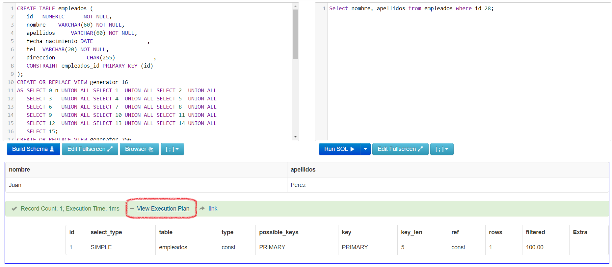
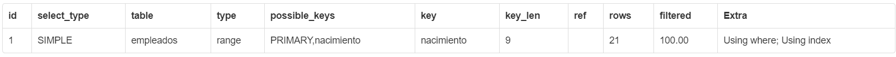

<link rel="stylesheet" type="text/css" href="estilos.css">
<div class="encabezado">
    <div class="h-izq">
        <h1 class="titulo-h1">Auronix University | <em>Curso SQL</em></h1>
    </div>
    <div class="h-der">
        <a href="indiceslentos.html"></a>
        <a href="../"></a>
        <a href="indicesconcatenados.html"></a>
    </div>   
</div>
 

# La claúsula where #

{:.justificado}
El filtro `where` define las condiciones de búsqueda en una enunciado *SQL*, esto es importante porque define si la BD usará funcionalmente el índice y determina el rendimiento de la consulta, generalmente una consulta lenta se debe a la mala programación de este filtro. 

{:.justificado}
Dentro de los operadores usados en un filtro where, el operador de *igualdad* es el más trivial y a menudo el más usado, sin embargo, es muy común que se combine con condiciones múltiples generando vulnerabilidad. 

Analicemos el comportamiento de la claúsula *where* con un ejemplo. Considere la tabla empleados con la siguiente definición:

```SQL
    CREATE TABLE empleados (
    id NUMBER NOT NULL,
    nombre VARCHAR(60) NOT NULL,
    apellidos VARCHAR(60) NOT NULL,
    fecha_nacimiento DATE NOT NULL,
    telefono  VARCHAR(20) NOT NULL,
    direccion CHAR(255) NOT NULL,
    PRIMARY KEY empleados_id(id)
    );
```

{:.justificado}
La BD crea automáticamente un índice sobre la llave primaria, el *id*, nota que en el BTree no habrá valores repetidos, esto quiere decir que si buscamos un empleado por coincidencia exacta sobre su campo llave, la búsqueda será muy rápida. Hagámos un ejemplo para entender mejor. Considera una consulta SQL para obtener el nombre y apellidos del empleado con **id=28**. 
```SQL
    Select nombre, apellidos from empleados where id=28;
```
{:.justificado}
En este ejemplo el filtro *where* hace uso del índice primario ejecutando una operación *INDEX UNIQUE SCAN*, no necesita recorrer la lista de nodos hoja (operación *INDEX RANGE SCAN*) porque no habrán llaves repetidas, por lo tanto, solo se recorre el árbol hasta llegar a la única hoja con el valor buscado, después se obtiene el registro a través de *TABLE ACCESS BY ROWID*. El costo en tiempo de la consulta es logarítmico más el costo de obtener el registro.

Si observamos el plan de ejecución podremos constatar que la hipotésis planteada sobre el uso del índice es correcta.

<div class="ejercicio execution-plan">
    <strong>Plan de ejecución MySql</strong><br/><br/>
    <table class="">
            <tr>
                <th>id</th>
                <th>select_type</th>
                <th>table</th>
                <th>type</th>
                <th>possible_keys</th>
                <th>key</th>
                <th>key_len</th>
                <th>ref</th>
                <th>rows</th>
                <th>filtered</th>
                <th>Extra</th>
            </tr>
            <tr>
                <td>1</td>
                <td>SIMPLE</td>
                <td>empleados</td>
                <td><strong><em style='color:blue;'>const</em></strong></td>
                <td>PRIMARY</td>
                <td>PRIMARY</td>
                <td>5</td>
                <td>const</td>
                <td>1</td>
                <td>100.0</td>
                <td>NULL</td>
            </tr>
    </table>    
    <p>En MySql el tipo <code>const</code> equivale a <em>INDEX UNIQUE SCAN</em></p>
</div>
<br/>

<div class="sugerencia">
    
    <a href="http://sqlfiddle.com/#!9/16920e/1/0" target="_blank">Prueba la ejecución de la consulta ejemplo haciendo click aquí.</a>    
</div>
<br/>

{:.justificado}
Para ver el plan ejecución después de probar el link de arriba, haz click sobre el hipervínculo *View Execution Plan*.


<div class="img-centrada">
    <br/>
    <strong>Figura 3.1. Ver el plan de ejecución en el portal SQL Fiddle.</strong>
</div>

{:.justificado}
Aunque se han escrito libros sobre el análasis puntual del plan de ejecución y como un DBA puede usarlo eficientemente, sigue siendo tema de toda una tésis, sin embargo, podemos rescatar datos importantes que como desarrolladores nos son de mucha utilidad para comprender y eficientar la indexación y nuestras consultas.

Para obtener el plan de ejecución en cualquier manejador de BD MySql basta con inyectar el enunciado SQL al comando <code> Explain</code>, por ejemplo:

```SQL
Explain Select * from empleados where id=28;
```

### ¿Cómo leer el plan de ejecución? ###

De todas las columnas resultantes en el plan de ejecución hay una de especial interés, la columna *type*, esta columna hace referencia a la forma en la que la BD busca los datos que se requieren en el enunciado SQL. Sus posibles valores son:

<table class="type-execution-plan">
    <tr>
        <th>Valor</th>
        <th>Significado</th>
    </tr>
    <tr>
        <td>eq_ref, const</td>
        <td>Es equivalente a la operación <em>INDEX UNIQUE SCAN</em>, obtendremos este valor cuando los criterios de búsqueda coincidan con el uso de una llave primaria o cualquier restricción de unicidad.</td>
    </tr>
    <tr>
        <td>ref, range</td>
        <td>Se refiere a la operación <em>INDEX RANGE SCAN</em>, es decir, recorre parcialmente los nodos hoja del Btree que representa al índice.</td>
    </tr>
    <tr>
        <td>index</td>
        <td>Lee el índice entero.</td>
    </tr>
    <tr>
        <td>ALL</td>
        <td>Esta operación es la menos deseable, no hace uso de ningún tipo de índice, lee todas las tuplas incluidas sus columnas y puede agregar una fuerte carga al procesador. También es conocida como <em>FULL TABLE SCAN</em>. Como desarrolladores debemos evitar que esta operación ocurra, sobre todo si la tabla tiene millones de registros.</td>
    </tr>
</table>
<br/>

## Búsqueda por múltiples campos ##

{:.justificado}
Es muy común escribir consultas que usen filtros sobre más de un campo, en estos casos se debe poner especial atención sobre la lógica que la BD usará para encontrar las tuplas que se requieren, si no indexamos correctamente o buscamos solo por campos que no tengan índice, corremos el riesgo de lanzar una operación *FULL ACCESS TABLE* y eso no es nada bueno cuando la tabla tiene millones de registros. El desarrollador debe cuidar que los accesos a la BD a través de las consultas SQL no terminen ejecutando esta operación.

{:.justificado}
Supongamos que queremos saber el nombre y apellido de todos los empleados que tengan un id menor a 100 y que su nombre contenga la cadena *'Juan'*. ¿Cuál es la consulta SQL para obtener los datos?.

```SQL
    Select nombre, apellidos from empleados where id<100 and nombre like '%Juan%';
```
<div class="ejercicio execution-plan">
    <strong>Plan de ejecución MySql</strong><br/><br/>
    <table class="">
            <tr>
                <th>id</th>
                <th>select_type</th>
                <th>table</th>
                <th>type</th>
                <th>possible_keys</th>
                <th>key</th>
                <th>key_len</th>
                <th>ref</th>
                <th>rows</th>
                <th>filtered</th>
                <th>Extra</th>
            </tr>
            <tr>
                <td>1</td>
                <td>SIMPLE</td>
                <td>empleados</td>
                <td><strong><em style='color:blue;'>range</em></strong></td>
                <td>PRIMARY</td>
                <td>PRIMARY</td>
                <td>4</td>
                <td></td>
                <td>99</td>
                <td></td>
                <td>Using where</td>
            </tr>
    </table>    
</div>
<br/>

¿Qué operaciones ejecutará la BD cuando mandemos la consulta?. Para responder a este cuestionamiento ejecutemos la consulta y observemos el plan de ejecución.

<div class="sugerencia">
    
    <a href="http://sqlfiddle.com/#!9/37b7f4/1/0" target="_blank">Prueba la ejecución de la consulta haciendo click aquí.</a>    
</div>
<br/>

{:.justificado}
Con base en lo aprendido hasta el momento, ¿Podemos explicar que fué lo que ocurrió en la BD cuando ejecutó la consulta?

{:.justificado}
Nota que la columna *type* en el plan de ejecución marca una operación *range* (*INDEX RANGE SCAN*), como en el predicado de la consulta aparece un campo que está indexado (el *id*), el motor de la BD toma este campo como prioridad y hace el recorrido sobre el BTree empezando en el nodo raíz y preguntadole a cada llave en ese nodo ¿Eres mayor o igual a 100?, cuando la respuesta es sí, se baja un nivel por esa rama y se repite el proceso, eventualmente llega al nodo hoja en la base del árbol que contiene la llave *100* y a partir de ahí inicia un recorrido secuencial sobre la lista enlazada hasta llegar a la llave de menor valor, la BD ejecutará para cada nodo hoja que cumpla con la restricción, una operación de acceso a la tabla a través del *RowID* y justo en ese momento tomará en cuenta la segunda parte del filtro <code><em>and nombre like '%Juan%'</em></code>, lo que significa que revisará el campo *nombre* y hará un análisis sobre la cadena para determinar si cumple con la restricción que especifica el operador *like*, de ser así, devuelve ese registro como resultado de la consulta. Una vez que el recorrido llega al primer nodo hoja, la ejecución de la consulta termina.

{:.justificado}
¿Podrás explicar que ocurre en la ejecución de la consulta si cambiamos la primera parte del filtro por `id>900` ? 

## Búsqueda por rangos ##

{:.justificado}
La búsqueda por rangos se implementa haciendo uso de los operadores `<, > y between`, regularmente, el uso de estos operadores dispara operaciones del tipo *INDEX RANGE SCAN*, el riesgo con esta operación es que se puede llegar a recorrer gran parte de la lista que representa a los nodos hoja, es recomendable mantener el rango escaneado lo más pequeño posible. Consideremos la ejecución de una consulta que busca saber cuantos empleados nacieron en el año 1970:

```SQL
    Select count(fecha_nacimiento) from empleados where fecha_nacimiento between '1970-01-01' and '1970-12-31';
```
<div class="ejercicio execution-plan">
    <strong>Plan de ejecución MySql</strong><br/><br/>
    <table class="">
            <tr>
                <th>id</th>
                <th>select_type</th>
                <th>table</th>
                <th>type</th>
                <th>possible_keys</th>
                <th>key</th>
                <th>key_len</th>
                <th>ref</th>
                <th>rows</th>
                <th>filtered</th>
                <th>Extra</th>
            </tr>
            <tr>
                <td>1</td>
                <td>SIMPLE</td>
                <td>empleados</td>
                <td><strong><em style='color:blue;'>ALL</em></strong></td>
                <td></td>
                <td></td>
                <td></td>
                <td></td>
                <td>985</td>
                <td></td>
                <td>Using where</td>
            </tr>
    </table>    
</div>
<br/>

<div class="sugerencia">
    
    <a href="http://sqlfiddle.com/#!9/82679d/1/0" target="_blank">Prueba la ejecución de la consulta haciendo click aquí.</a>    
</div>
<br/>

{:.justificado}
Si ejecutamos esta consulta y observamos el plan de ejecución encontramos que se disparó una operación *ALL*, lo que significa que se escaneó toda la tabla. ¿De que forma podemos mejorar el costo de ejecución de la consulta?. Agregando un índice con repeticiones sobre el campo de *fecha_nacimiento*, podemos hacerlo de varias formas:

```SQL
    ALTER TABLE empleados ADD INDEX nacimiento(fecha_nacimiento);
```

```SQL
    CREATE INDEX nacimiento ON empleados(fecha_nacimiento);
```

O bien desde la definición de la tabla:

```SQL
   CREATE TABLE empleados (
   id NUMERIC NOT NULL,
   nombre VARCHAR(60) NOT NULL,
   apellidos VARCHAR(60) NOT NULL,
   fecha_nacimiento DATE ,
   tel VARCHAR(20) NOT NULL,
   direccion CHAR(255),
   PRIMARY KEY empleados_id(id),
   KEY nacimiento(fecha_nacimiento)
);
```
{:.justificado}
Ejecutando nuevamente la consulta, con el índice sobre la *fecha_nacimiento* agregado, el costo de ejecución mejora notablemente debido a que se utiliza el índice para buscar los datos. Ejecuta la consulta y compara el plan de ejecución.

<div class="ejercicio execution-plan">
    <strong>Plan de ejecución MySql</strong><br/><br/>
    <table class="">
            <tr>
                <th>id</th>
                <th>select_type</th>
                <th>table</th>
                <th>type</th>
                <th>possible_keys</th>
                <th>key</th>
                <th>key_len</th>
                <th>ref</th>
                <th>rows</th>
                <th>filtered</th>
                <th>Extra</th>
            </tr>
            <tr>
                <td>1</td>
                <td>SIMPLE</td>
                <td>empleados</td>
                <td><strong><em style='color:blue;'>range</em></strong></td>
                <td>nacimiento</td>
                <td>nacimiento</td>
                <td>4</td>
                <td></td>
                <td>28</td>
                <td></td>
                <td>Using where;Using index</td>
            </tr>
    </table>    
</div>
<br/>

<div class="sugerencia">
    
    <a href="http://sqlfiddle.com/#!9/ee3f0c/1/0" target="_blank">Prueba la ejecución de la consulta haciendo click aquí.</a>    
</div>
<br/><br/>

{:.justificado}
La tabla ahora cuenta con dos índices, uno primario (id) y otro que acepta repeticiones (fecha_nacimiento), analicemos que ocurre si lanzamos una consulta que obligue al manejador de la BD a decidir qué índice usar. Supongamos que queremos saber cuantos empleados nacieron en 1970 y su id está entre 300 y 500.

```SQL
    Select count(*) from empleados where id>300 and id<500 and fecha_nacimiento between '1970-01-01' and '1970-12-31';
```
<div class="ejercicio execution-plan">
    <strong>Plan de ejecución MySql</strong><br/><br/>
    <table class="">
            <tr>
                <th>id</th>
                <th>select_type</th>
                <th>table</th>
                <th>type</th>
                <th>possible_keys</th>
                <th>key</th>
                <th>key_len</th>
                <th>ref</th>
                <th>rows</th>
                <th>filtered</th>
                <th>Extra</th>
            </tr>
            <tr>
                <td>1</td>
                <td>SIMPLE</td>
                <td>empleados</td>
                <td><strong><em style='color:blue;'>range</em></strong></td>
                <td>PRIMARY, nacimiento</td>
                <td>nacimiento</td>
                <td>8</td>
                <td></td>
                <td>28</td>
                <td></td>
                <td>Using where;Using index</td>
            </tr>
    </table>    
</div>
<br/>

Como puedes notar el predicado del filtro *where* es más complejo, entonces, como decide el manejador usar los índices en esta caso?. Probemos la consulta y analicemos el plan de ejecución:

<div class="sugerencia">
    
    <a href="http://sqlfiddle.com/#!9/ee3f0c/10/0" target="_blank">Prueba la ejecución de la consulta haciendo click aquí.</a>    
</div>
<br/><br/>

<div class="img-centrada">
    <br/>
    <strong>Figura 3.2. Plan de ejecución para filtro por id y fecha de nacimiento.</strong>
</div>

{:.justificado}
Si observas detenidamente la *figura 3.2*, encontrarás que la BD consideró ambos índices, la columna *possible keys* en el plan de ejecución lo evidencia, sin embargo, el plan eligió el índice con repeticiones (*nacimiento* en la columna *key*) para encontrar los datos. Parecería que el plan de ejecución está equivocado porque el índice primario tiene solo claves únicas, pero si obligamos al motor a usar el índice primario sobre el *id*, confirmaremos que tomó la mejor decisión.

Prueba la consulta forzando el uso del índice primario y compara el rendimiento.

```SQL
    Select count(*) from empleados force index(PRIMARY) where id>300 and id<500 and fecha_nacimiento between '1970-01-01' and '1970-12-31';
```

<div class="ejercicio execution-plan">
    <strong>Plan de ejecución MySql</strong><br/><br/>
    <table class="">
            <tr>
                <th>id</th>
                <th>select_type</th>
                <th>table</th>
                <th>type</th>
                <th>possible_keys</th>
                <th>key</th>
                <th>key_len</th>
                <th>ref</th>
                <th>rows</th>
                <th>filtered</th>
                <th>Extra</th>
            </tr>
            <tr>
                <td>1</td>
                <td>SIMPLE</td>
                <td>empleados</td>
                <td><strong><em style='color:blue;'>range</em></strong></td>
                <td>PRIMARY</td>
                <td>PRIMARY</td>
                <td>4</td>
                <td></td>
                <td>199</td>
                <td></td>
                <td>Using where;Using index</td>
            </tr>
    </table>    
</div>
<br/>

Analiza ambas consultas y argumenta, ¿Por qué crees que ocurra esto?

<div class="ejercicio">
    <strong>Ejercicios 3.1:</strong><br/>
    Ejecuta las siguientes consultas, observa el plan de ejecución y argumenta el resultado de la columna <em>type</em>.
    <br/><br/>
    <ol>
        <li>
            <code>Select nombre from empleados where apellidos='Perez';</code>
        </li>
        <li>
            <code>Select count(*) from empleados;</code>
        </li>
        <li>
            <code>Select * from empleados where id>=20 and id<=30;</code>
        </li>
    </ol>
    <br/>
    <div style="text-align:center;">
        <a href="http://sqlfiddle.com/#!9/37b7f4/12" target="_blank">Click aquí para ejecutar las consultas</a>
    </div>
</div>
<br/>

<div class="ejercicio execution-plan">
    <strong>Plan de ejecución MySql para Ejercicios 3.1:</strong><br/><br/>
    <table class="">
            <tr>
                <th>id</th>
                <th>select_type</th>
                <th>table</th>
                <th>type</th>
                <th>possible_keys</th>
                <th>key</th>
                <th>key_len</th>
                <th>ref</th>
                <th>rows</th>
                <th>filtered</th>
                <th>Extra</th>
            </tr>
            <tr>
                <td>1</td>
                <td>SIMPLE</td>
                <td>empleados</td>
                <td><strong><em style='color:blue;'>ALL</em></strong></td>
                <td></td>
                <td></td>
                <td></td>
                <td></td>
                <td>985</td>
                <td></td>
                <td>Using where;</td>
            </tr>
            <tr>
                <td>2</td>
                <td>SIMPLE</td>
                <td>empleados</td>
                <td><strong><em style='color:blue;'>index</em></strong></td>
                <td></td>
                <td>nacimiento</td>
                <td>4</td>
                <td></td>
                <td>985</td>
                <td></td>
                <td>Using index</td>
            </tr>
             <tr>
                <td>3</td>
                <td>SIMPLE</td>
                <td>empleados</td>
                <td><strong><em style='color:blue;'>range</em></strong></td>
                <td>PRIMARY</td>
                <td>PRIMARY</td>
                <td>4</td>
                <td></td>
                <td>11</td>
                <td></td>
                <td>Using where</td>
            </tr>
    </table>    
</div>
<br/>


<style>
    *{
        box-sizing:border-box !important;
    }
    .type-execution-plan th{
        text-align:center !important;

    }
    .type-execution-plan td{
        text-align:justify !important;
    }
    .type-execution-plan tr td:first-child{
        font-style:italic !important;
    }
</style>